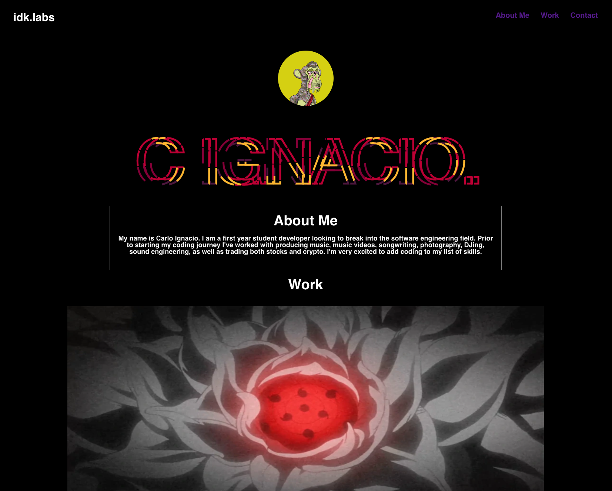

# Engineer Portfolio

## Description

This app is a portfolio for a first year web developer. It contains three main sections: About Me, My Work, and a call to action contact form. This web page is designed to be an interactive online resume for potential clients or jobs. The purpose of this page is to generate traffic and opportunities for future projects. I decided to use a call to action fill out form rather than links to my socials/email for the Contact section so the e-mails can later be stored for uses such as a mailing list.

## Technologies Used

HTML  
CSS  

## Installation

There is no installation necessary, the app may be accessed via this link - https://casignacio.github.io/portfolio/

## Usage

The links in the nav bar will direct you to the corresponding information.

